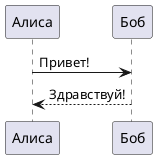

# plantuml-docs

## диаграмма uml
### Диаграмма 2

```plantuml
@startuml
Алиса -> Боб: Привет!
Боб --> Алиса: Здравствуй!
@enduml

@startuml
class User {
  +String name
  +login()
}
class AuthService
User --> AuthService: использует
@enduml
```
